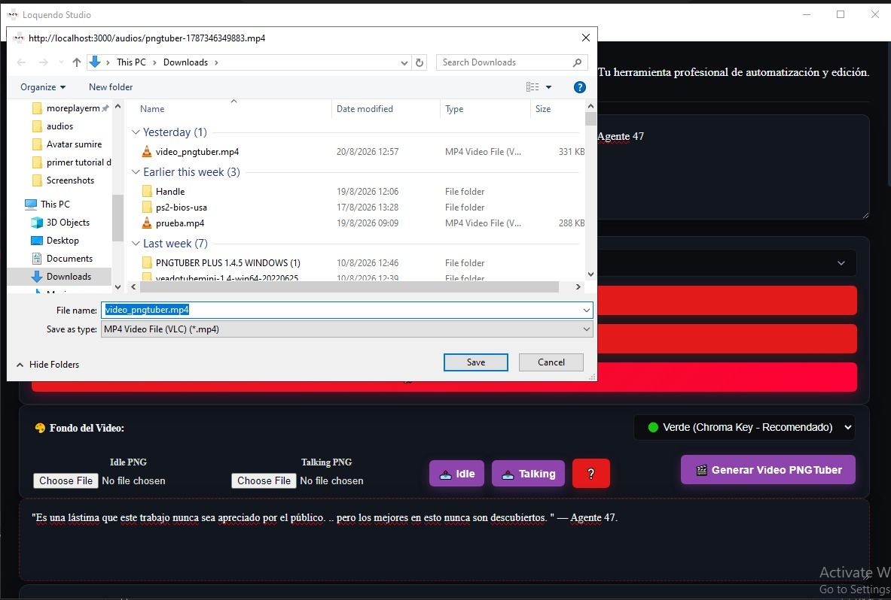

# 🎙️ Loquendo Studio

### Suite profesional de automatización de voz y edición multimedia

[](https://github.com/MayorFabDV/Loquendo-Studio/releases)
[](https://github.com/MayorFabDV/Loquendo-Studio/releases)
[](LICENSE)
[]()

**Convierte texto en audio profesional, genera subtítulos con IA, aplica efectos visuales y crea videos PNGTuber — todo en una sola aplicación offline.**

[Características](#-características) •
[Descarga](#-descarga) •
[Desarrollo](#️-para-desarrolladores) •
[Roadmap](#-roadmap) •
[Licencia](#-licencia)


---

## 📖 Tabla de Contenidos

- [Características Principales](#-características-principales)
- [Stack Tecnológico](#-stack-tecnológico)
- [Vista Previa](#-vista-previa)
- [Descarga](#-descarga)
- [Para Desarrolladores](#️-para-desarrolladores)
- [Estructura del Proyecto](#-estructura-del-proyecto)
- [Cómo Funciona](#-cómo-funciona)
- [Roadmap](#-roadmap)
- [Testers](#-testers)
- [Contribuir](#-contribuir)
- [Licencia](#-licencia)

---

## ✨ Características Principales

### 🎙️ Síntesis de Voz
- **Voces Loquendo**: Jorge, Carlos, Carmen, Diego, Ludoviko, Esperanza, Francisca, Leonor, Soledad, Ximena
- **Voces Microsoft**: Helena, Sabina, David, Zira
- **Voces Acapella**: Diego, Carmen, Jorge
- **Detección automática** de voces instaladas en el sistema
- **SSML completo**: pausas, velocidad, tono, volumen, énfasis, deletreo
- **Multi-voz**: cambia de voz dentro del mismo texto con `[voz:nombre]`
- **Expresiones**: risa, suspiro, grito, llanto, susurro, enojo, felicidad, tristeza, sorpresa, miedo

### 📝 Procesamiento de Texto
- **5 diccionarios personalizables**: jergas, sinónimos, fonética, ortografía, gramática
- **Corrección con LanguageTool** (Java): ortografía, gramática y puntuación
- **Comas inteligentes**: +80 conectores detectados
- **Puntos inteligentes**: puntuación automática
- **Modos de narración**: Estándar, Creepypasta, Tutorial, Gameplay

### 🎵 Editor de Audio
- **WaveSurfer integrado**: visualización de ondas en tiempo real
- **Recortar**: elimina secciones no deseadas
- **Fade In/Out**: transiciones suaves
- **Normalizar**: volumen consistente
- **Eliminar silencios**: automáticamente
- **Historial**: Deshacer/Rehacer (Ctrl+Z/Ctrl+Y)
- **Atajos**: Espacio, Delete, Ctrl+Z, Ctrl+Y, M

### 🎚️ Ducking Inteligente
- **Sidechain compression** con FFmpeg
- **Volumen configurable** de la música
- **Fade In/Out** de la música
- **Loop** para música de fondo
- **Umbral y ratio** ajustables
- **Ocultar automáticamente** la música después de aplicar

### 📄 Subtítulos con IA
- **Whisper.cpp** (C++): transcripción offline sin Python
- **Modelo ggml-small** incluido
- **Subtítulos dinámicos**: 2-15 palabras por línea
- **Formato SRT**: para YouTube, VLC, etc.
- **Formato ASS**: con efectos visuales
- **Sin internet**: 100% offline

### 🎬 Video PNGTuber
- **Imágenes Idle/Talking**
- **Fondos**: verde (chroma key), negro, transparente
- **Renderizado MP4** con FFmpeg
- **Listo para OBS/Streamlabs**

### 💾 Exportación
- **WAV** (sin pérdida)
- **MP3** (comprimido)
- **SRT** (subtítulos)
- **ASS** (subtítulos con efectos)
- **MP4** (video PNGTuber)

### 🎨 Interfaz
- **Diseño moderno** con iconos SVG
- **Tema oscuro/claro**
- **Vista horizontal/vertical**
- **Notificaciones elegantes** (sin alertas)
- **Modales de ayuda y testers**
- **Selector de etiquetas interactivo**
- **Expresiones rápidas**
- **Enlaces externos** en navegador

---

## 🛠️ Stack Tecnológico

| Tecnología | Uso | Lenguaje |
|------------|-----|----------|
| **Electron** | Framework de escritorio | JavaScript |
| **Node.js + Express** | Backend API REST | JavaScript |
| **Python 32 bits** | Síntesis de voz con SAPI | Python |
| **Java + LanguageTool** | Corrección ortográfica | Java |
| **Whisper.cpp** | Transcripción de audio con IA | C++ |
| **FFmpeg** | Procesamiento de audio/video | C |
| **WaveSurfer.js** | Editor de audio | JavaScript |
| **HTML/CSS** | Interfaz | HTML/CSS |

**4 lenguajes integrados**: JavaScript + Python + Java + C++

---

## 🖼️ Vista Previa



---

## 📥 Descarga

### Para Usuarios (Portable)

1. Ve a la sección **[Releases](https://github.com/MayorFabDV/Loquendo-Studio/releases)**
2. Descarga `LoquendoStudio-Portable-1.0.0.exe`
3. Ejecuta el archivo
4. ¡Listo!

**Requisitos:**
- ✅ Windows 10/11 (64 bits)
- ✅ Loquendo instalado (opcional, para voces Loquendo)
- ❌ No requiere Node.js
- ❌ No requiere Python
- ❌ No requiere Java
- ❌ No requiere internet

### Para Usuarios (Instalador)

1. Descarga `Loquendo Studio Setup 1.0.0.exe`
2. Ejecuta el instalador
3. Sigue las instrucciones

---

## 🛠️ Para Desarrolladores

### Requisitos

- [Node.js](https://nodejs.org/) 18+
- [Python](https://python.org/) 3.10+ (32 bits, solo para desarrollo)
- [Java](https://adoptium.net/) 17+ (para LanguageTool)
- Windows 10/11

### Instalación

```bash
# 1. Clonar el repositorio
git clone https://github.com/MayorFabDV/Loquendo-Studio.git
cd Loquendo-Studio

# 2. Instalar dependencias
npm install

# 3. Ejecutar en desarrollo
npm start
Compilación
bash
# Compilación portable (recomendado)
npm run build:portable

# Compilación con instalador
npm run build:nsis

# Compilación rápida (sin limpiar)
npm run build
📁 Estructura del Proyecto
text
Loquendo-Studio/
├── backend/
│   ├── bin/                    # Binarios nativos
│   │   ├── ffmpeg.exe          # Procesamiento audio/video
│   │   ├── generar_voz.exe     # Síntesis de voz (32 bits)
│   │   ├── whisper-cli.exe     # Whisper.cpp (IA)
│   │   ├── ggml-small.bin      # Modelo Whisper
│   │   ├── jre/                # Java Runtime Environment
│   │   └── languagetool/       # LanguageTool
│   ├── db/                     # Diccionarios (JSON)
│   ├── modules/                # Scripts Python
│   ├── python/                 # Python 32 bits embebido
│   ├── services/               # Servicios Node.js
│   └── public/                 # Archivos generados
├── frontend/
│   ├── css/                    # Estilos
│   ├── js/                     # Scripts
│   │   ├── core/               # Configuración
│   │   ├── ui/                 # Interfaz
│   │   ├── services/           # Servicios
│   │   └── libs/               # Librerías locales
│   ├── img/                    # Assets
│   └── index.html              # Interfaz principal
├── main-electron.js            # Entry point de Electron
├── server.js                   # API REST
└── package.json
🎯 Cómo Funciona
text
1. 📝 Escribe o pega tu texto
   ↓
2. ⚙️ Activa opciones (ortografía, gramática, jergas, etc.)
   ↓
3. ✨ Optimiza el texto (diccionarios + puntuación)
   ↓
4. 🔍 Corrige con LanguageTool (opcional)
   ↓
5. 🎙️ Selecciona voz y modo de narración
   ↓
6. 🔊 Genera audio (WAV + SRT/ASS automáticamente)
   ↓
7. ✂️ Edita el audio (cortar, fades, normalizar)
   ↓
8. 🎵 Sube música y aplica Ducking
   ↓
9. 📄 Exporta a MP3
   ↓
10. 🎬 Genera video PNGTuber
🚀 Roadmap
✅ v1.0 (Completada)
☑ Síntesis de voz con Loquendo
☑ Editor de audio con WaveSurfer
☑ Ducking con FFmpeg
☑ Subtítulos con Whisper.cpp
☑ LanguageTool
☑ Diccionarios (5 tipos)
☑ Video PNGTuber
☑ Exportación MP3
🔄 v2.0 (En desarrollo)
□ Migración a Tauri (Rust)
□ Editor de subtítulos avanzado
□ Editor de audio avanzado (Tone.js)
□ Editor de video multipista
□ Versión Android
□ Versión iOS
🔮 v3.0 (Futuro)
□ IA generativa de guiones
□ Clonación de voz
□ Traducción automática
□ Publicación automática a YouTube
□ Colaboración en tiempo real
🧪 Testers
Gracias a los testers que hicieron posible esta versión:

Tester	Rol	Canal
LautyKT	Tester	YouTube
Allstarz	Tester	YouTube
DarkerGhost	Tester	YouTube
Leo	Tester	-
CreepyMoxo	Tester	YouTube
🤝 Contribuir
¡Las contribuciones son bienvenidas!

Fork el proyecto

Crea una rama (git checkout -b feature/NuevaCaracteristica)

Commit tus cambios (git commit -m 'Añade NuevaCaracteristica')

Push a la rama (git push origin feature/NuevaCaracteristica)

Abre un Pull Request

📄 Licencia
Este proyecto está bajo la licencia ISC. Ver el archivo LICENSE para más detalles.

🙏 Agradecimientos
Loquendo por las voces

OpenAI por Whisper

LanguageTool por la corrección ortográfica

FFmpeg por el procesamiento multimedia

WaveSurfer.js por el editor de audio

Electron por el framework

Mis testers por el feedback


Creado con ❤️ por BafYam

https://img.shields.io/badge/YouTube-BafYamRevival-red?style=for-the-badge&logo=youtube
https://img.shields.io/badge/Ko--fi-Apoyar-FF5E5B?style=for-the-badge&logo=ko-fi

⭐ Si te gusta el proyecto, dale una estrella ⭐

